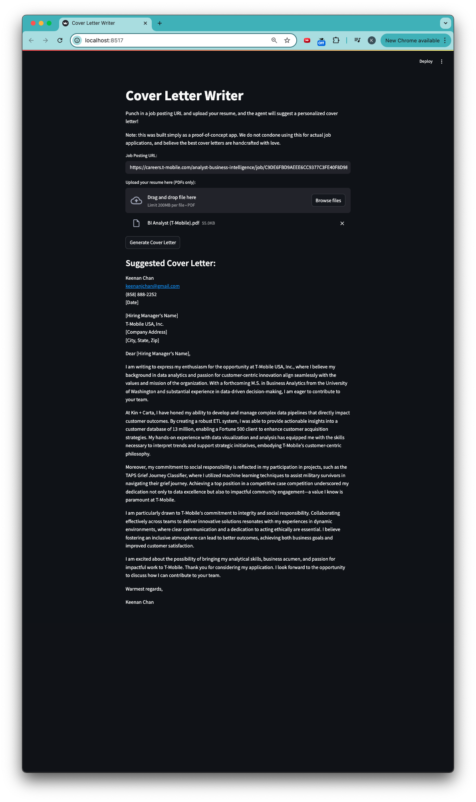

# Cover Letter Generator
---
This app uses LangChain + Tavily Search + OpenAI (GPT-4o-mini), and automatically drafts up a cover letter if you input a job posting and upload your PDF!

## Features
---
* **Tavily Search** tracks down the company's values page, extracting company core values
* **PDF parsing** takes your experience and maps them to core values
* **Streamlit UI** provides an intuitive UI

## Demo
---


## Installation
---

1. **Clone the repo**
```bash
git clone https://github.com/keenanchan/cover_letter_writer.git
cd cover_letter_writer
```

2. **Create a virtual environment and install dependencies**
```bash
python3 -m venv .venv
source .venv/bin/activate
pip install -r requirements.txt
```

3. **Configure your OpenAI and Tavily Search API keys**
Use the `.env.example` file as a reference to create a `.env` file. This is where your API keys will live.
```bash
OPENAI_API_KEY=YOUR_KEY
TAVILY_API_KEY=YOUR_KEY
```

4. **Run the app!**
```bash
streamlit run CoverLetterAgent.py
```

## Usage
---
* Paste in the link to the job posting
* Upload your resume
* Click **Generate Cover Letter**!

## Disclaimer
---
This was intended as a toy app to learn more about LangChain and AI agents. I cannot recommend using this to actually write cover letters for real job postings - after all, the cover letters that really wow the hiring managers are the ones that show who you are as a person, beyond the resume!